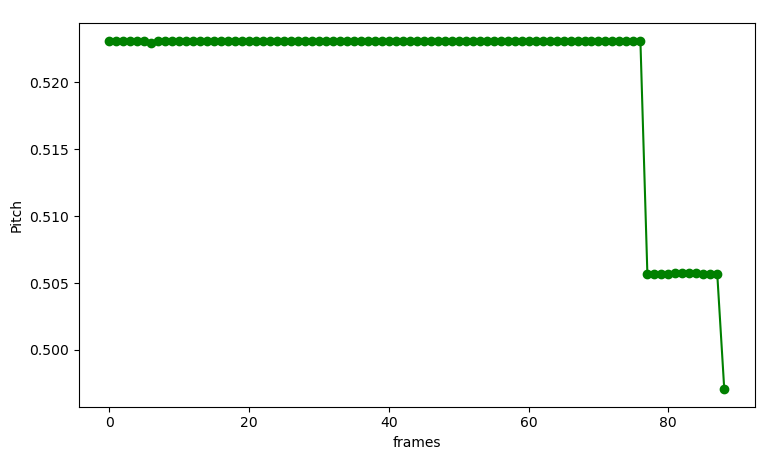
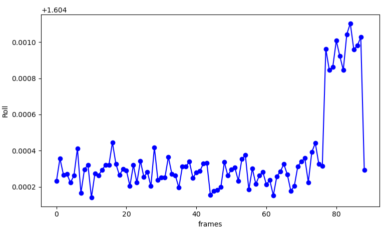
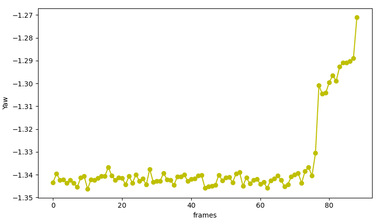

# Camera Position Estimate (Hough Transform and Homography)
A computer vision program that detects an A4 piece of paper in a video feed and computes a homography matrix to determine the camera's position relative to the paper using world coordinates as a reference. The program's output is the camera's position, pitch, roll, and yaw.

## Prerequisites
- Python 3.7 or higher
- OpenCV
- NumPy
- Matplotlib
- tqdm

## Usage
1. Install the required libraries: pip install opencv-python numpy matplotlib tqdm
2. Run the program: python camera_pos.py

## Working
1. Run the "camera_pos.py" python file in any python environment to obtain the camera position, pitch, roll and yaw plot. (The python code takes approximately 15 mins to run)

## Example
Below is an example of the output generated by the program.

## License

[MIT](https://choosealicense.com/licenses/mit/)